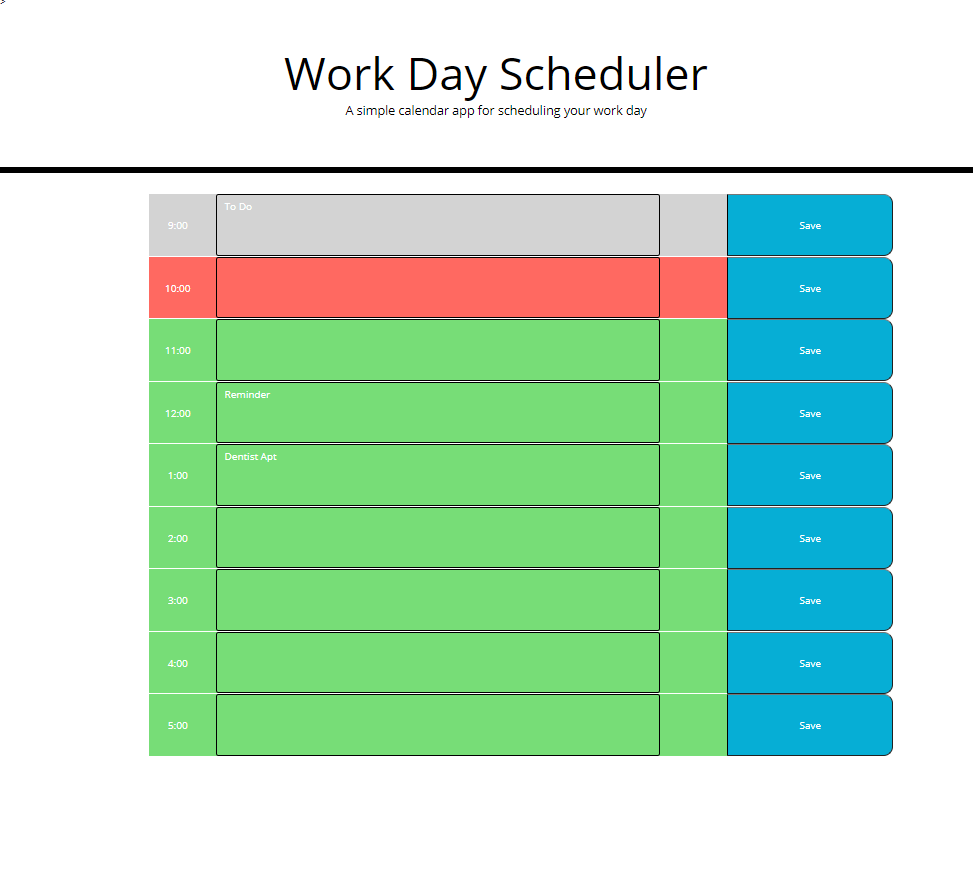

# Day-planner

This simple calendar scheduler will help you organize your time and never miss an appointment. 

# Intoduction 
This application uses basic jQuery, manipulating HTML style and elements base on user inputs and click events. Localstorage is used to store appointments on click and render them on page window loads.

When you open the planner the current day is displayed at the top of the calendar
and you are presented with time blocks for standard business hours. Each time block is color-coded to indicate whether it is in the past, present, or future. After clicking into a time block , user can enter an event and save it for that time block.

## Scheduler Preview

The following image shows your planner 's appearance and functionality. 

## Installation
[Project_Link] (https://rolandgjoka.github.io/Day-planner/)